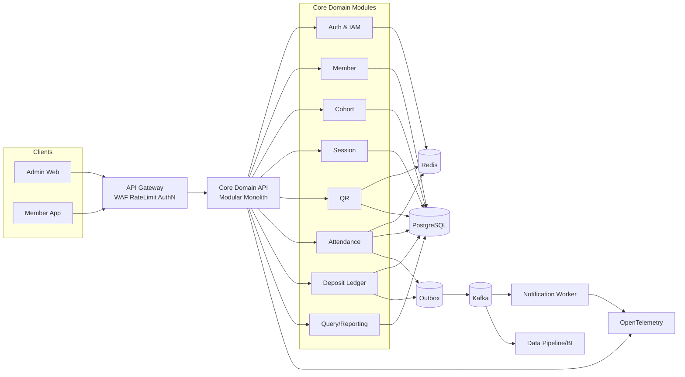
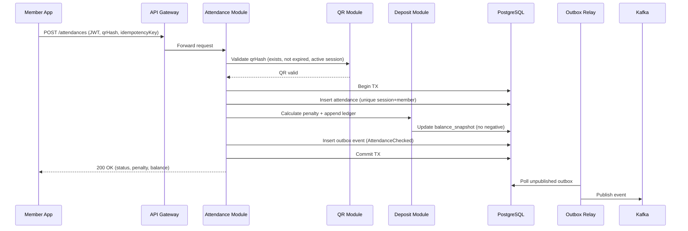

# System Design Architecture

## 1. 문서 목적
이 문서는 프로그래피 출결/보증금 관리 서비스의 **이상적인 목표 아키텍처(TO-BE)** 를 정의합니다.
현재 구현(단일 Spring Boot + H2)과 달라도 되며, 실제 운영 환경에서 필요한 확장성/정합성/관측성을 기준으로 설계했습니다.

## 2. 설계 원칙
- **정합성 우선**: 출결 중복 불가, 보증금 음수 금지, 공결 횟수 제한(기수별 최대 3회)을 강하게 보장
- **도메인 중심 분리**: Member/Cohort/Session/QR/Attendance/Deposit 경계를 명확히 유지
- **단순한 운영**: 과도한 마이크로서비스 분할보다, 모듈형 코어 + 이벤트 확장 구조 채택
- **점진적 확장**: 초기에는 모듈형 모놀리스, 트래픽/조직 규모 증가 시 서비스 단위 분리

## 3. 목표 아키텍처 개요

## 4. 런타임 컴포넌트

| 컴포넌트 | 책임 | 비고 |
|---|---|---|
| API Gateway | TLS 종료, 인증 위임, Rate Limit, API 라우팅 | Cloud LB + Gateway 조합 권장 |
| Core Domain API | 핵심 비즈니스 로직 처리 | Java 21, Spring Boot, 모듈형 패키지 |
| PostgreSQL | 트랜잭션 원장 저장소 | 운영환경 기본 DB, 읽기 복제본 분리 |
| Redis | 캐시/락/멱등키/세션 | QR 검증 캐시, 중복 출결 방지 보조 |
| Kafka | 도메인 이벤트 스트림 | 알림/통계/감사 로그 비동기 확장 |
| Notification Worker | Slack/Email/Push 발송 | 실패 재시도 + DLQ |
| Observability Stack | 로그/메트릭/트레이스 수집 | Prometheus + Grafana + Loki/ELK |

## 5. 도메인 경계와 데이터 소유권

| 모듈 | 주요 엔티티 | 불변식(Invariant) |
|---|---|---|
| Auth & IAM | Account, Role, SessionToken | 탈퇴 회원 로그인 차단, 권한 기반 접근(RBAC) |
| Member | Member | `loginId` 유니크, 상태 전이 정책 준수 |
| Cohort | Cohort, Part, Team, CohortMember | 기수-회원 관계 단일성 유지 |
| Session | ClubSession | 상태 전이(SCHEDULED→IN_PROGRESS→COMPLETED/CANCELLED) |
| QR | QrCode | 세션별 활성 QR 1개만 허용 |
| Attendance | Attendance | `(session_id, member_id)` 유니크로 중복 출석 방지 |
| Deposit Ledger | DepositEntry, BalanceSnapshot | 잔액 음수 금지, 금전 변경은 Ledger append-only |

## 6. 데이터 설계 원칙
- **PostgreSQL 표준화**
  - 운영 DB: PostgreSQL Primary + Read Replica
  - 모듈별 스키마 분리(`auth`, `member`, `attendance`, `deposit` ...)
- **핵심 제약조건을 DB에 강제**
  - `UNIQUE (login_id)`
  - `UNIQUE (session_id, member_id)`
  - `CHECK (deposit_balance >= 0)`
- **보증금은 Ledger 중심**
  - `deposit_entry`에 모든 증감 이력 append
  - 조회 성능을 위해 `balance_snapshot`을 트랜잭션 내 동기 갱신
- **Outbox 패턴**
  - 출결/보증금 변경 시 같은 트랜잭션으로 outbox 이벤트 기록
  - 별도 relay가 Kafka 발행(유실/중복 제어)

## 7. 핵심 시퀀스: QR 출석 체크

## 8. 보안 아키텍처
- 인증: `JWT Access(15m) + Refresh Token(14d)`
- 인가: 역할 기반(`ADMIN`, `MEMBER`) + 리소스 소유권 검증
- 비밀번호: `BCrypt cost 12+` + 로그인 시도 제한
- 네트워크: 전 구간 TLS, 내부망(private subnet) 통신
- 데이터 보호: 개인정보 컬럼 암호화(전화번호 등), 감사 로그 분리 저장

## 9. 운영/관측성
- **SLO 예시**
  - API 가용성 99.9%/월
  - 출석 등록 API p95 < 400ms
- **모니터링 지표**
  - 출석 성공률, 중복 출석 차단 횟수, QR 만료 실패율
  - 보증금 부족 에러율, 큐 지연, DB 락 대기시간
- **장애 대응**
  - Kafka/Worker DLQ
  - Redis 장애 시 DB 폴백 경로 유지
  - Circuit Breaker + Retry(지수 백오프)

## 10. 배포 구조 (권장)
- 인프라: AWS 기준 `ALB + ECS/Fargate 또는 EKS`
- 데이터: `RDS PostgreSQL Multi-AZ`, `ElastiCache Redis`
- 배포: GitHub Actions 기반 CI/CD
  - PR: 테스트 + 정적 분석
  - main: 이미지 빌드 후 Staging 배포
  - 승인 후 Production Blue/Green

## 11. 단계별 진화 전략
1. **Phase 1 (현재 대비 즉시 개선)**: H2 → PostgreSQL, JWT 인증, Redis 멱등키/캐시, DB 제약 강화
2. **Phase 2 (운영 안정화)**: Outbox + Kafka, 관측성 스택 구축, 알림 워커 분리
3. **Phase 3 (규모 확장)**: Attendance/Deposit 모듈을 독립 서비스로 분리, 조회계 CQRS 분리

## 12. 이 아키텍처의 핵심 가치
- 도메인 규칙(출결/보증금)을 기술적으로 강제해 데이터 신뢰성 확보
- 운영 난이도는 낮추면서도 이벤트 기반 확장성 확보
- 과제 수준을 넘어 실서비스 전환 가능한 구조로 진화 가능

GPT-5.3-Codex Extra High model로 작성된 파일입니다. 